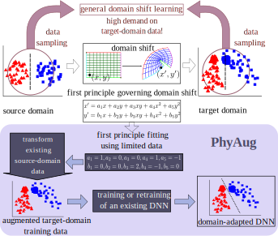

# PhyAug
This Repo includes the code for each case study in IPSN'21 paper: [PhyAug: Physics-Directed Data Augmentation for Deep Sensing Model Transfer in Cyber-Physical Systems](https://arxiv.org/pdf/2104.01160.pdf).

A detailed **README** on how to run the code is constructed for each case study:
1. [Case study 1: Keyword Spotting](https://github.com/jiegev5/PhyAug/tree/main/key_word_spotting)
  - Key stats: there are 14% - 19% absolute accuracy drops if testing pretrained model on recorded microphone dataset. PhyAug is able to recover 53% - 72% accuracy loss.
2. [Case study 2: Speech Recognition](https://github.com/jiegev5/PhyAug/tree/main/ASR)
  - Key stats: there are 15% - 35% absolute WER increases if testing pretrained model on recorded microphone dataset. PhyAug is able to recover 37% - 70% accuracy loss.
3. [Case study 3: Seismic Source Localization](https://github.com/jiegev5/PhyAug/tree/main/seismic_localization)
  - Key stats: SVM/MLP needs more than 8,000 training samples to achieve 92% inference accuracy. With PhyAug, only less than 3% training samples are needed.

## Approach overview

<strong>Fig.1: Approach overview</strong>

In this project, we propose *physics-directed data augmentation* (PhyAug) approach to efficiently address domain shift in cyber-physical systems. As illustrated in upper part of the Fig.1, the general transfer learning approaches regardless of the first principles need to draw substantial data samples from both source and target domains. As illustrated in the lower part of Fig.1, our approach uses a minimum amount of data collected from the target domain to estimate the parameters of the first principle governing the domain shift process, then uses the parametric first principle to generate augmented target-domain training data. Finally, the augmented target-domain data samples are used to transfer source-domain DNN.

## Dataset
We collect our own dataset for each case study. All our datasets are made publicly available. Their download links can be found in each case study's README. 

## Programs and neural network models
This repo contains the programs to train and evaluate the neural network models used in all the three case studies. Because neural network model training time is lengthy (e.g., up to 2 days for the speech recognition case study), this repo also provides the neural network models that we have trained. They can be evaluated using the test dataset.

## Hardware specification
All programs in this repo have been tested successfully on a workstation with the following hardware specification.
- CPU: Intel Core i9-7900X 3.30GHz 13.75MB Cache 10C/20T
- GPU: 4x Zotac nVidia RTX2080Ti 11GB GDDR6 PCIe x16 GPU Card
- Memory: Kingston 128GB DDR4-2666MHz RAM (8 x 16GB – QVL memory)

## Citation
If the resources in this repo benefit your work, please cite the following paper in your publication:

@inproceedings{luo2021phyaug, \
  title={PhyAug: Physics-Directed Data Augmentation for Deep Sensing Model Transfer in Cyber-Physical Systems},\
  author={Luo, Wenjie and Yan, Zhenyu and Song, Qun and Tan, Rui},\
  booktitle={The 20th ACM/IEEE International Conference on Information Processing in Sensor Networks (IPSN)},\
  year={2021}\
}
